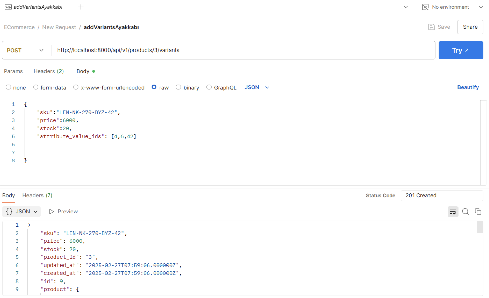

# 🛒 E-Commerce JSON:API (Laravel)

Bu proje, **Laravel** framework’ü kullanılarak geliştirilmiş, **JSON:API standardına** uygun bir e-ticaret REST API uygulamasıdır.  
API; ürün, kategori, marka, varyant yönetimi ve kimlik doğrulama işlemlerini destekler.  

---

## 📂 Proje Mimarisi (Katmanlı Yapı)

Proje, **katmanlı mimari** prensiplerine uygun olarak geliştirilmiştir:

- **Controller Layer**  
  HTTP isteklerini karşılar, ilgili servisleri çağırır ve JSON:API formatında cevap döner.  
  Örn: `ProductController`, `AuthController`

- **Service Layer**  
  İş mantığının yazıldığı katmandır. Controller’dan gelen veriyi işler, repository metodlarını çağırır.  
  Örn: `ProductService`, `UserService`

- **Repository Layer**  
  Veritabanı ile iletişim katmanıdır. Laravel Eloquent ORM sorgularını içerir.  
  Örn: `ProductRepository`

- **Model Layer**  
  Laravel Eloquent modellerini barındırır. Veritabanı tablolarını temsil eder.  
  Örn: `Product`, `Category`, `User`

---

## 📸 Ekran Görüntüleri

| Ürünler |
|---------------|-----------|
|  |

| Stoklar |
|--------------|--------------|
|  | 
